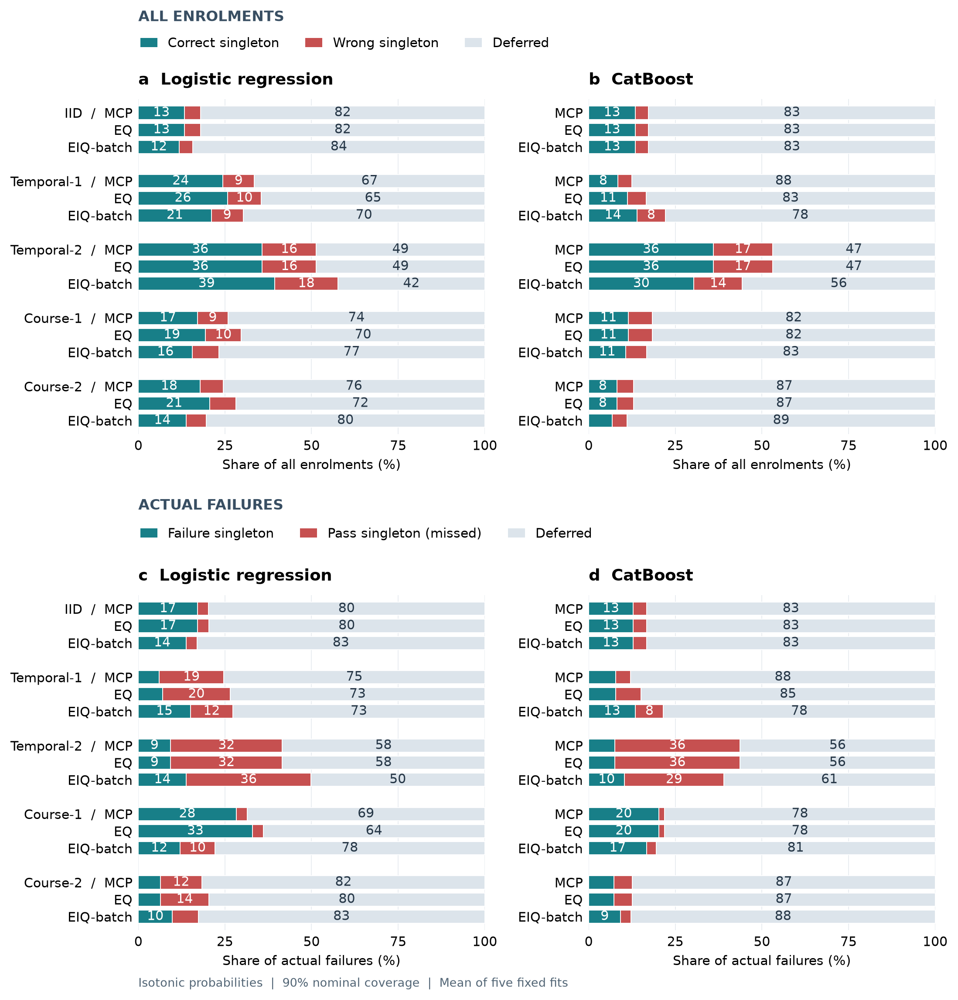

# AI_for_edu

**Calibration and conformal prediction for student early warning across courses and academic years**

Reproducible analysis code, aggregate results and figures for a study of educational model reliability under distribution shift. The manuscript is in preparation; no journal acceptance or publication is implied.



The analysis distinguishes discrimination, probability calibration, class-specific prediction-set coverage and selective error. High coverage can coexist with substantial deferral or missed failures. This exploratory study does not establish the safety or effectiveness of automated student-support decisions.

## Study overview

- **Primary data:** 4,280 enrolments in two KU Leuven courses across three academic years; 137 enrolments have no recorded activity in the first 28 days.
- **Models:** Logistic Regression and CatBoost, five source-partition seeds and five fixed target settings.
- **Calibration:** untransformed, Platt-type and isotonic probabilities.
- **Prediction sets:** Mondrian conformal prediction (MCP), equal-weight empirical quantiles (EQ), and an estimated importance-weighted empirical heuristic (EIQ-batch). The latter has no finite-sample conformal guarantee.
- **Sensitivity analyses:** class weighting, target-adaptation access, activity windows, weight caps, probability calibration and zero-activity subgroups.
- **External analysis:** independently fitted OULAD models with person-disjoint partitions and person-clustered uncertainty intervals.

## Contents and data access

| Location | Contents |
|---|---|
| `src/edu_shift/` | Feature construction, models, calibration, conformal and selective evaluation |
| `scripts/` | Experiment, statistics, validation and figure-generation entry points |
| `configs/`, `environment.yml` | Analysis configuration and environment |
| `tests/` | Automated checks of core analytical behaviour |
| `outputs/revision_v2/` | Base and OULAD aggregate results |
| `outputs/revision_v3/` | Factorial sensitivity summaries |
| `outputs/revision_v4/` | Course stratification, conditional intervals and decision composition |
| `figures/` | Research figures, including the preview above |
| [Data access](docs/DATA_ACCESS.md) | Original sources, Google Drive package status, checksums and extraction |
| [Reproduction guide](docs/REPRODUCIBILITY.md) | Commands to validate, regenerate figures or refit models |
| [上传维护说明（中文）](docs/UPLOAD_GUIDE.zh-CN.md) | GitHub and Google Drive maintenance instructions |

## Download the companion data

This repository is the public entry point for the study's code and companion data. **Use this README for the current data download location.** If the storage location changes, the links below will be updated here; the repository URL remains the entry point cited in the manuscript.

- **[Download the version 1.0.0 data ZIP](https://drive.google.com/uc?export=download&id=1HoSkyFWVetEhL8B19NV-seETIfqMLDoa)** (`AI_for_edu_data_v1.0.0.zip`, 18,795,926 bytes).
- **[Open the Google Drive folder](https://drive.google.com/drive/folders/1JM6_PfNNw40j4FWhqAvTGxRweyQwsyAr?usp=sharing)** for the ZIP, `AI_for_edu_data_v1.0.0.zip.sha256` and `DATA_MANIFEST.json`.
- Follow the [data access and checksum instructions](docs/DATA_ACCESS.md) before extraction, then the [reproduction guide](docs/REPRODUCIBILITY.md).

Anonymous download and SHA-256 verification passed on 20 September 2026. The package contains derived features, partition memberships, predictions and other reproduction inputs; these files are kept outside Git. Original data sources and their terms are listed in the data-access documentation. All results can also be regenerated from the original public datasets using the full workflow.

The repository does not contain the unpublished manuscript, author-information documents, raw datasets, credentials or internal review correspondence.

## Quick start

```bash
git clone https://github.com/Yongt-D/AI_for_edu.git
cd AI_for_edu
conda env create -f environment.yml
conda activate aiedu
python -m pytest -q
```

The tests use synthetic fixtures and do not require the research data. To regenerate results, follow the reproduction guide after obtaining the source data or companion package. Commands run from the repository root. Windows users can use `powershell -ExecutionPolicy Bypass -File scripts/run_aiedu.ps1 ...` after activating the environment; `AIEDU_PYTHON` optionally selects another interpreter.

## Interpretation and citation

The five source partitions share fixed target cohorts; their ranges are sensitivity summaries, not independent cohort replication. Target-bootstrap intervals condition on fitted models and estimated weights. Course-level results stratify pooled-model predictions. OULAD uses a different non-success endpoint including withdrawal.

Use [CITATION.cff](CITATION.cff) to cite the software and record the exact Git commit or release tag. Cite the original data providers listed in [DATA_LICENSES.md](DATA_LICENSES.md). Original software is MIT licensed; derived tables and figures are CC BY 4.0 with source attribution. No Zenodo deposit is used for this project.
